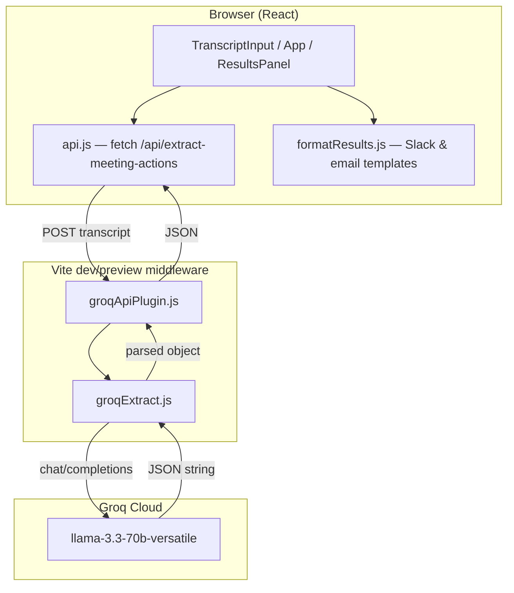

# Meeting → Actions

**Turn messy meeting transcripts into accountable follow-ups—in one paste.**

Meeting → Actions is a single-page app that sends a transcript to an LLM-backed “meeting analyst,” extracts structured decisions and action items, surfaces ambiguity instead of hiding it, and exports copy-ready Slack or email follow-ups.

---

## Why this problem?

Meetings produce outcomes, but those outcomes rarely leave the room in a usable form. Someone takes notes in a doc, half the action items never get an owner, “next Friday” means different things to different people, and the follow-up message in Slack is written from memory three hours later—if it gets written at all.

The gap isn’t “we need another meeting tool.” It’s the **last mile between conversation and commitment**: turning unstructured dialogue into a shared artifact that answers:

- What did we decide?
- Who owns what, by when?
- What’s still unresolved?

That last mile is repetitive, error-prone, and almost always done by a human re-reading a transcript or their own notes. It’s exactly the kind of structured extraction task language models are good at—*if* you constrain the output and refuse to pretend confidence where there is none.

---

## What made you pick it?

Three reasons this problem stood out:

1. **High frequency, low joy.** Knowledge workers sit in recurring syncs, planning calls, and 1:1s. The pain happens every week; the “fix” (manual note cleanup) never feels worth a dedicated afternoon—so it stays broken.

2. **Clear success criteria.** Unlike open-ended chat, meeting follow-up has a schema people already use: decisions, owners, deadlines, open questions. That makes it possible to evaluate quality (“Did it catch Sarah owning the pricing page?”) without subjective “vibes.”

3. **Honest human-in-the-loop design.** A bad meeting agent that invents owners or deadlines is worse than no agent. This project optimizes for **flagging uncertainty** (missing owner, vague deadline, low confidence) rather than producing a polished lie. That design choice is the product.

---

## How did you discover it was worth solving?

Validation came from a simple pattern, not a formal study:

| Signal | What it showed |
|--------|----------------|
| **Post-meeting friction** | People re-read transcripts, hunt for “who said they’d do X,” and still miss items. |
| **Sample transcripts fail in interesting ways** | A short status-style meeting might yield *no* hard decisions—forcing an empty state instead of hallucinated tasks. |
| **Export is the real deliverable** | The “aha” moment isn’t the JSON; it’s pasting a Slack block or email into the team channel in 10 seconds. |
| **Ambiguity is common** | Phrases like “John mentioned he’d look into it” or “we still haven’t decided on enterprise pricing” appear constantly in real notes—exactly where automation must **escalate**, not guess. |

The app was built to test one hypothesis: **a constrained analyst prompt + structured UI beats a generic “summarize this meeting” chat** for accountability. Early runs on sample transcripts showed the model could extract real items *and* correctly leave owners null or add flags when ownership was implied but not assigned—confirming the problem was worth a focused tool rather than a general assistant.

---

## Who is the user?

**Primary:** The person who owns meeting outcomes—often a **PM, engineering lead, team lead, or chief-of-staff type** who runs or attends cross-functional syncs and is responsible for circulating follow-ups.

**Secondary:**

- **Individual contributors** who want a draft follow-up without writing it from scratch.
- **Founders / ops** on small teams without a dedicated note-taker.
- **Anyone** with a transcript (Zoom, Google Meet, Otter, manual notes) who needs decisions and actions in a shareable format.

**Not the target user (today):**

- Organizations needing real-time meeting capture, calendar integration, or task sync into Jira/Asana (no integrations in v1).
- Compliance-heavy environments requiring on-prem models or audit trails (Groq cloud API only in this version).

**Job to be done:** *“I have a transcript. Give me a accurate follow-up I can send to the team, and show me what still needs a human decision.”*

---

## Architecture: how does the agent work?

This app uses a **single-shot LLM analyst** (not a multi-tool autonomous agent loop). The “agent” is the system prompt + post-processing + UI policy that together behave like an analyst with clear autonomy boundaries.



### Request flow

1. User pastes a transcript and clicks **Analyze Meeting**.
2. `App.jsx` sets loading state and calls `extractMeetingActions()` in `src/lib/api.js`.
3. The client POSTs to `/api/extract-meeting-actions` (same origin).
4. `server/groqApiPlugin.js` handles the route and calls `extractMeetingActionsFromGroq()` in `src/lib/groqExtract.js`.
5. The server sends a **system prompt** (meeting analyst schema + rules + today’s date) and the **user message** (raw transcript) to Groq.
6. The model returns text; the server parses JSON (strips markdown fences if present).
7. If JSON is malformed, the server **retries once** with: *“Your previous response was not valid JSON…”*
8. Structured JSON returns to the client; `ResultsPanel` renders summary, flags, action cards, and export tabs.

### Security note

`GROQ_API_KEY` lives in `.env` and is read only on the **server** (`process.env` in the Vite middleware). It is not exposed via `VITE_*` variables or the client bundle.

### Project structure

```
src/
  App.jsx                 # State, submit flow, error handling
  components/
    TranscriptInput.jsx   # Input, sample loader, submit
    ResultsPanel.jsx      # Results, empty state, copy export
  lib/
    api.js                # Client fetch + NetworkError / ApiError
    groqExtract.js        # Groq call, prompt, parse, retry
    formatResults.js      # Slack & email formatters
server/
  groqApiPlugin.js        # /api/extract-meeting-actions middleware
```

---

## What does the agent decide autonomously?

The LLM analyst is instructed to make these **low-risk, reversible** judgments without asking the user:

| Autonomous decision | Example |
|--------------------|---------|
| **Extract decisions** from narrative vs. off-topic chat | “We’re going with the new pricing model in Q3” → decision |
| **Split action items** from vague commitments | “Sarah, can you own the pricing page?” → task + owner |
| **Assign confidence** (`high` / `medium` / `low`) per item | Clear assignment vs. “John might look into it” |
| **Resolve relative dates** using “today” in the prompt | “next Friday” → concrete ISO-style date |
| **Summarize** in 2–3 sentences | Neutral recap for Slack/email |
| **Populate `open_questions`** | “We still haven’t decided on enterprise discounting” |
| **Emit `warnings`** | Empty extractions, ambiguous meetings, missing context |
| **Retry formatting** (server-side) | One extra Groq call if JSON parse fails |

Temperature is kept low (`0.2`) to favor consistent structure over creative prose.

---

## What does it escalate to the human?

The app **does not** auto-send Slack messages, create calendar events, or assign tasks in external systems. Humans stay in the loop for anything that affects accountability:

| Escalation | UI / data signal |
|------------|------------------|
| **Missing owner** | `owner: null` + red badge: “No owner assigned” + optional `flag` on the card |
| **Missing or vague deadline** | `deadline: null` + yellow “Needs clarification” badge, or `flag` when a date was inferred |
| **Low confidence** | Red/yellow confidence badge on the action card |
| **Warnings & flags** | Yellow **“Needs your attention”** callout (global warnings + per-item flags) |
| **No extractable work** | Empty state: *“No clear decisions or actions were found…”* |
| **API / network failure** | Distinct error copy for connection vs. Groq/API errors |
| **Final send** | User must review, edit, and click **Copy to clipboard**—nothing is posted automatically |

**Design principle:** When the transcript doesn’t support a fact, the system **surfaces gap** (`null`, `flag`, `warnings`) instead of inventing owners or dates.

---

## What did you learn?

### Product & UX

- **Schema beats summary.** Users don’t need another paragraph; they need owners, dates, and a list they can paste. Structuring the model output as JSON made the UI predictable.
- **Empty results are valid.** Status updates and social meetings should not spawn fake action items—the empty state is a feature.
- **Export is the payoff.** Building Slack and email formatters early made the tool feel “done” even before polish elsewhere.

### Engineering

- **Server-side API keys matter.** Front-end-only Groq calls would expose keys in the bundle; a thin Vite middleware keeps secrets in `.env`.
- **LLMs break JSON often.** A single retry with an explicit “JSON only” instruction recovered most parse failures without complex tooling.
- **Static deploy ≠ full app.** GitHub Pages can host the UI, but the Groq proxy only runs under `vite dev` / `vite preview` unless you add a serverless backend—deployment shape affects architecture.
- **Model deprecation is real.** Groq retired `llama3-70b-8192`; pinning to `llama-3.3-70b-versatile` required a one-line change but would have broken production silently without clear API errors.

### Trust & evaluation

- **Confidence labels and flags build trust** more than eloquent summaries.
- **Sample transcripts** (built into the UI) double as regression fixtures for “messy but realistic” meetings.
- **Human review remains mandatory** for anything that goes to a team channel—the agent drafts; the owner of the meeting approves.

---

## Quick start

### Prerequisites

- Node.js 18+
- A free [Groq API key](https://console.groq.com/keys)

### Setup

```bash
npm install
```

Create `.env` in the project root:

```env
GROQ_API_KEY=your_key_here
```

```bash
npm run dev
```

Open the URL from the terminal (usually `http://localhost:5173`).

### Get a Groq API key

1. Sign up at [console.groq.com](https://console.groq.com)
2. Open [API Keys](https://console.groq.com/keys)
3. Create a key and copy it into `.env` as `GROQ_API_KEY`
4. Restart the dev server after changing `.env`

---

## Build & deploy

```bash
npm run build
```

**GitHub Pages (static UI only):** The analyze endpoint requires the Vite server middleware. For a static Pages deploy, the UI loads but API calls fail unless you add a backend.

```bash
npm install --save-dev gh-pages
npm run build
npx gh-pages -d dist
```

Enable **Settings → Pages → Branch: `gh-pages` / root**.

For a fully working hosted demo, use `npm run preview` locally after build, or deploy the middleware to a serverless function.

---

## Tech stack

- **React 19** + **Vite 8**
- **Tailwind CSS 4**
- **Groq** (`llama-3.3-70b-versatile`) via OpenAI-compatible chat API
- **lucide-react** icons

---

## License

Private / educational use unless otherwise specified.
