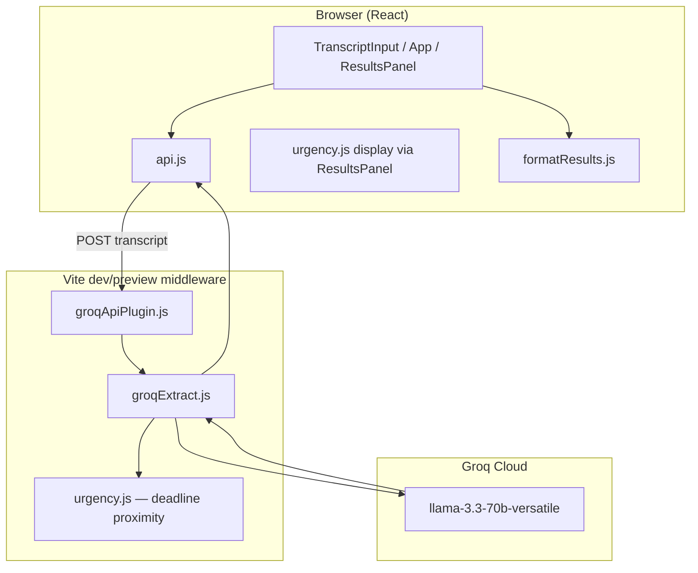

# Meeting → Actions

**Turn messy meeting transcripts into accountable follow-ups—in one paste.**

Meeting → Actions is a single-page app that sends a transcript to an LLM-backed meeting analyst, extracts structured decisions and action items, surfaces ambiguity instead of hiding it, and exports copy-ready Slack or email follow-ups.

---

## Features (current)

| Feature | Description |
|---------|-------------|
| **Structured extraction** | Decisions, action items, open questions, summary, warnings |
| **Multilingual input** | Paste transcripts in **English, Roman Urdu** (Urdu in Latin script), or a mix — the model analyzes the content and returns structured output in English |
| **Confidence** | Per-item `high` / `medium` / `low` based on how explicit the transcript is |
| **Urgency** | `Urgent` badge when deadline is within 7 days (or overdue) or the meeting marked the item as critical |
| **Escalation UI** | Missing owners, unclear deadlines, flags, and a “Needs your attention” callout |
| **Export** | Copy Slack or email follow-up from a dark preview panel |
| **Sample transcript** | One-click load in the UI for quick testing |
| **Secure API key** | `GROQ_API_KEY` in `.env`, used server-side only (not in the browser bundle) |

---

## Multilingual transcripts (including Roman Urdu)

You can paste meeting notes in **English**, **Roman Urdu** (Urdu typed in Latin letters—the way people write in WhatsApp, Slack, or voice-to-text), or a mix of both. You do **not** need the Urdu keyboard or Arabic script.

The system:

1. Reads and understands Roman Urdu or English as pasted.
2. Extracts the same schema (decisions, actions, open questions, etc.).
3. Writes **summary and field values in English** in the results and exports (easy to share with the wider team).

**Example (Roman Urdu input):**

```
Aaj ki meeting mein hum ne decide kiya ke Q3 se nayi pricing model lage gi.
Sarah website ki pricing page ki zimmedar hongi, launch se pehle complete karna hai.
John ne email campaign ke baare mein bola lekin clear owner nahi mila.
Enterprise discount abhi decide nahi hua — next meeting mein dekhenge.
```

**Not required:** Arabic-script Urdu (e.g. اردو keyboard). Roman Urdu works the same way for analysis.

The app will still produce structured action items, urgency signals, and exports—the analyzer does not require English-only input.

---

## Output fields explained

| Field | Meaning |
|-------|---------|
| **Decisions** | Things the group agreed on |
| **Action items** | Tasks with owner, deadline, confidence, optional urgency |
| **Open questions** | Topics raised but **not resolved** (no owner/date yet)—e.g. “we still need to decide on enterprise pricing” |
| **Summary** | Short neutral recap |
| **Warnings / flags** | Ambiguity, missing owners, vague commitments |

### Confidence vs urgency

- **Confidence** — How clearly the transcript states the item (`high` = firm owner/commitment, `low` = hedged or vague). Shown on every action and decision.
- **Urgency** — Whether to treat the item as time-critical **now**. Shown only when `is_urgent` is true:
  - Deadline within **7 days** (computed in `src/lib/urgency.js`), or
  - Meeting language marks it as blocking / before launch / top priority (LLM).

Urgent items are sorted to the top of the action list.

---

## Why this problem?

Meetings produce outcomes, but those outcomes rarely leave the room in a usable form. Someone takes notes in a doc, half the action items never get an owner, “next Friday” means different things to different people, and the follow-up message in Slack is written from memory three hours later—if it gets written at all.

The gap is the **last mile between conversation and commitment**: turning unstructured dialogue into a shared artifact that answers what was decided, who owns what, and what is still unresolved.

---

## What made you pick it?

1. **High frequency, low joy** — Recurring syncs; manual cleanup never gets prioritized.
2. **Clear success criteria** — Decisions, owners, deadlines, open questions map to a real schema.
3. **Honest human-in-the-loop design** — Flag uncertainty instead of inventing owners or dates.

---

## How did you discover it was worth solving?

| Signal | What it showed |
|--------|----------------|
| Post-meeting friction | People re-read transcripts and still miss items |
| Empty states | Status meetings should not spawn fake tasks |
| Export as deliverable | Pasting Slack/email is the “aha” moment |
| Roman Urdu notes | Common in local teams; one analyzer, English output for follow-ups |

---

## Who is the user?

**Primary:** PMs, engineering leads, team leads, or ops owners who circulate meeting follow-ups.

**Secondary:** ICs, founders, anyone with a transcript (Zoom, Meet, Otter, handwritten notes).

**Job to be done:** *“I have a transcript—in English or Roman Urdu. Give me a follow-up I can send, and show me what still needs a human decision.”*

---

## Architecture: how does the agent work?

Single-shot LLM analyst: system prompt + JSON parse + urgency enrichment + UI—not a multi-tool agent loop.



### Request flow

1. User pastes a transcript (any supported language) and clicks **Analyze Meeting**.
2. Client POSTs to `/api/extract-meeting-actions`.
3. Server calls Groq with the analyst prompt + today’s date.
4. Response is parsed as JSON; on failure, **one retry** with a stricter JSON instruction.
5. `urgency.js` enriches action items (near-deadline rules) and sorts urgent items first.
6. `ResultsPanel` renders summary, decisions, actions, open questions, and export tabs.

### Security

`GROQ_API_KEY` is read only in server middleware (`process.env`), not via `VITE_*` or the client bundle.

### Project structure

```
src/
  App.jsx                    # Layout, stats, submit flow
  components/
    TranscriptInput.jsx      # Input, sample loader
    ResultsPanel.jsx         # Results + export
    SectionHeader.jsx
  lib/
    api.js                   # Client fetch, NetworkError / ApiError
    groqExtract.js           # Groq prompt, parse, retry
    urgency.js                 # Near-deadline urgency rules
    formatResults.js           # Slack & email
server/
  groqApiPlugin.js             # API route middleware
```

---

## What does the agent decide autonomously?

| Decision | Example |
|----------|---------|
| Extract decisions / actions / open questions | From English or Roman Urdu dialogue |
| Assign confidence | Explicit vs hedged wording |
| Mark urgency | Near deadline or meeting emphasis |
| Resolve relative dates | “next Friday” → `YYYY-MM-DD` using today |
| Summarize | 2–3 sentences in English |
| Retry on bad JSON | One follow-up Groq call |

---

## What does it escalate to the human?

| Signal | UI |
|--------|-----|
| Missing owner | Unassigned badge + optional flag |
| Unclear deadline | “Needs clarification” badge |
| Low confidence | Muted confidence pill |
| Warnings / flags | “Needs your attention” section |
| No decisions/actions | Empty-state message |
| Final send | User copies export—nothing auto-posted |

---

## What did you learn?

- **Schema beats summary** for accountability workflows.
- **Confidence ≠ urgency** — separate rules and UI reduce false “everything is urgent.”
- **Open questions** deserve their own bucket—not every unresolved topic is an action item.
- **Roman Urdu input** works well for informal meeting notes; English output keeps follow-ups professional.
- **Server-side keys** and **JSON retry** are small choices that matter in real use.
- **Static GitHub Pages** hosts UI only; analyze needs `npm run dev` or `npm run preview` unless you add a backend.

---

## Quick start

### Prerequisites

- Node.js 18+
- [Groq API key](https://console.groq.com/keys) (free tier: ~30 RPM for `llama-3.3-70b-versatile` — see [Groq rate limits](https://console.groq.com/docs/rate-limits))

### Setup

```bash
npm install
```

Create `.env`:

```env
GROQ_API_KEY=your_key_here
```

```bash
npm run dev
```

Open `http://localhost:5173`. Use **Load sample** or paste your own transcript (English or Roman Urdu).

### Get a Groq API key

1. [console.groq.com](https://console.groq.com) → sign up  
2. [API Keys](https://console.groq.com/keys) → create key  
3. Add to `.env` as `GROQ_API_KEY`  
4. Restart the dev server  

---

## Build & deploy

```bash
npm run build
```

Vite is configured with `base: './'` for GitHub Pages.

**Note:** Analyze only works when the Vite API middleware runs (`npm run dev` or `npm run preview`). Pure static hosting serves the UI but not `/api/extract-meeting-actions`.

```bash
npm install --save-dev gh-pages
npm run build
npx gh-pages -d dist
```

Enable **Settings → Pages → Branch: `gh-pages` / root**.

---

## Tech stack

- React 19 + Vite 8  
- Tailwind CSS 4 + Inter  
- Groq `llama-3.3-70b-versatile`  
- lucide-react  

---

## License

Private / educational use unless otherwise specified.
