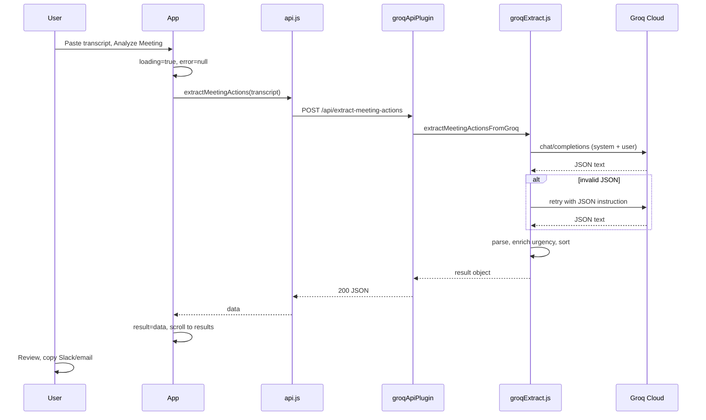
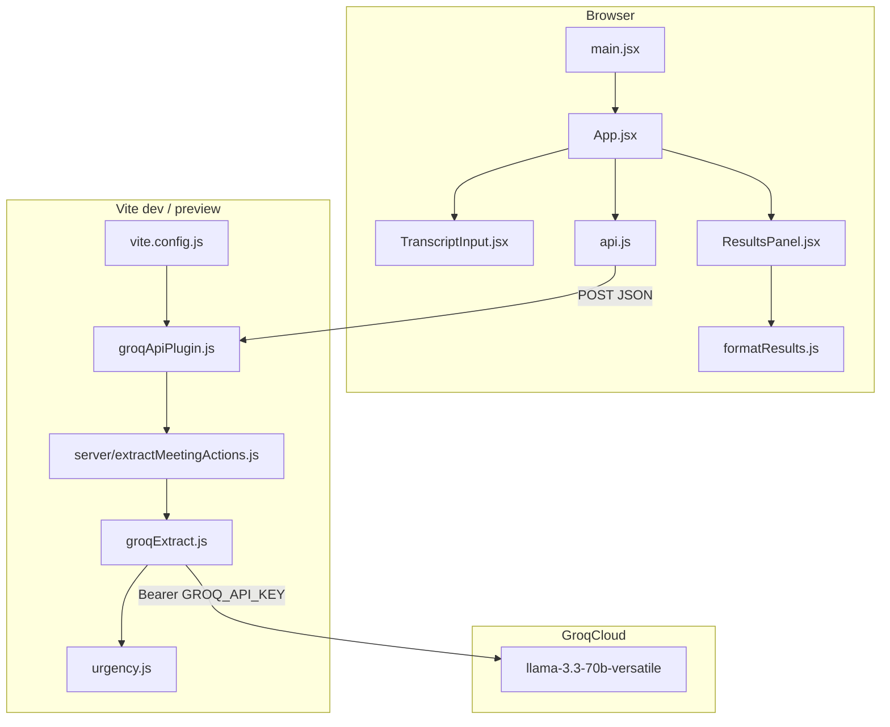

# Meeting → Actions

**Turn messy meeting transcripts into accountable follow-ups—in one paste.**

Meeting → Actions is a React single-page application that sends meeting transcripts to a Groq-hosted LLM, extracts structured decisions and action items, surfaces ambiguity (missing owners, vague deadlines, low confidence), marks urgency, and exports copy-ready Slack or email follow-ups. The API key never ships to the browser.

---

## Table of contents

1. [Overview](#overview)
2. [Features](#features)
3. [Roman Urdu and multilingual input](#roman-urdu-and-multilingual-input)
4. [Output schema](#output-schema)
5. [Field glossary](#field-glossary)
6. [Confidence vs urgency](#confidence-vs-urgency)
7. [User flow](#user-flow)
8. [Architecture](#architecture)
9. [File reference](#file-reference)
10. [API endpoint](#api-endpoint)
11. [Groq integration](#groq-integration)
12. [System prompt rules](#system-prompt-rules)
13. [Urgency post-processing](#urgency-post-processing)
14. [Error handling](#error-handling)
15. [UI components](#ui-components)
16. [Export formats](#export-formats)
17. [Configuration](#configuration)
18. [Quick start](#quick-start)
19. [Scripts](#scripts)
20. [Build and deployment](#build-and-deployment)
21. [Rate limits](#rate-limits)
22. [Test transcripts](#test-transcripts)
23. [Limitations](#limitations)
24. [Product context](#product-context)
25. [Tech stack](#tech-stack)

---

## Overview

| | |
|---|---|
| **What it does** | Parses meeting text → structured JSON → professional UI + Slack/email export |
| **Model** | `llama-3.3-70b-versatile` on [Groq](https://console.groq.com) |
| **Input** | Plain text transcript (English, Roman Urdu, or mixed) |
| **Output language** | English (for sharing); input can be Roman Urdu |
| **Runtime** | Vite dev server / preview with a Node middleware proxy for Groq |

---

## Features

| Feature | Implementation |
|---------|----------------|
| Structured extraction | Decisions, action items, open questions, summary, warnings |
| Roman Urdu input | System prompt in `groqExtract.js`; no Urdu keyboard required |
| Confidence badges | `high` / `medium` / `low` on decisions and actions |
| Urgency | LLM + code (`urgency.js`): near deadline or meeting-critical |
| Human escalation | Null owners, unclear deadlines, flags, attention callout |
| JSON retry | One Groq retry if model returns invalid JSON |
| Secure API key | `GROQ_API_KEY` server-side only |
| Sample transcript | **Load sample** in `TranscriptInput.jsx` |
| Stats header | Decision / action / urgent counts in `App.jsx` |
| Export | Slack (markdown-style) and email with copy-to-clipboard |
| Empty state | When no decisions and no actions |
| Network vs API errors | `NetworkError` / `ApiError` in `App.jsx` |
| Dark mode | Tailwind `dark:` variants throughout |
| GitHub Pages–ready assets | `base: './'` in `vite.config.js` |

---

## Roman Urdu and multilingual input

### What is supported

- **English** — standard meeting notes, Zoom exports, bullet points.
- **Roman Urdu** — Urdu written in **Latin script** (e.g. `aaj ki meeting mein hum ne decide kiya`). Typical in WhatsApp, Slack, and voice-to-text notes.
- **Mixed** — English and Roman Urdu in the same paste.

### What is not required

- Arabic-script Urdu (اردو keyboard).
- A separate “Urdu mode” toggle.

### Output language

All JSON string fields (summary, tasks, decisions, flags, warnings, open questions) are requested in **English** so Slack/email follow-ups work for mixed teams.

### Example (Roman Urdu input)

```
Aaj ki meeting mein hum ne decide kiya ke Q3 se nayi pricing model lage gi.
Sarah website ki pricing page ki zimmedar hongi, launch se pehle complete karna hai.
John ne email campaign ke baare mein bola lekin clear owner nahi mila.
Enterprise discount abhi decide nahi hua — next meeting mein dekhenge.
```

### Built-in English sample

**Load sample** fills the textarea with the `SAMPLE_TRANSCRIPT` constant in `TranscriptInput.jsx` (pricing model, Sarah, John, enterprise discount).

---

## Output schema

The model must return **only** this JSON (no markdown wrapper; fences are stripped if present):

```json
{
  "decisions": [
    {
      "text": "string",
      "confidence": "high|medium|low"
    }
  ],
  "action_items": [
    {
      "task": "string",
      "owner": "string or null",
      "deadline": "string or null",
      "confidence": "high|medium|low",
      "is_urgent": false,
      "urgency_reason": "string or null",
      "flag": "string or null"
    }
  ],
  "open_questions": [
    { "text": "string" }
  ],
  "summary": "2-3 sentence meeting summary",
  "warnings": ["string"]
}
```

After the Groq response, `finalizeResult()` in `groqExtract.js` runs `enrichActionItemsWithUrgency()` and `sortActionItemsByUrgency()` on `action_items`.

---

## Field glossary

### `decisions[]`

Things the group **agreed on** during the meeting.

| Field | Type | Meaning |
|-------|------|---------|
| `text` | string | Wording of the decision |
| `confidence` | `high` \| `medium` \| `low` | How explicit the agreement was in the transcript |

Shown in **Decisions** with a confidence pill. Included in Slack/email exports.

### `action_items[]`

Tasks someone should do, with accountability fields.

| Field | Type | Meaning |
|-------|------|---------|
| `task` | string | What needs to be done |
| `owner` | string \| `null` | Who owns it; `null` if unclear → UI shows **Unassigned** |
| `deadline` | string \| `null` | Target date (prefer `YYYY-MM-DD`); `null` → **Needs clarification** |
| `confidence` | `high` \| `medium` \| `low` | How clearly stated (not the same as urgency) |
| `is_urgent` | boolean | Set by LLM and/or `urgency.js` (see below) |
| `urgency_reason` | string \| `null` | Short explanation when urgent |
| `flag` | string \| `null` | Extra note (e.g. vague owner, inferred date) |

Urgent items appear first, with an orange **Urgent** badge and optional top accent bar.

### `open_questions[]`

Topics **raised but not resolved** — not action items because there is no clear owner or commitment yet.

| Field | Type | Meaning |
|-------|------|---------|
| `text` | string | The unresolved topic |

**Examples:** “We haven’t decided on enterprise pricing,” “Should we include the tutorial video?” (deferred).

### `summary`

2–3 sentence neutral recap in English. Shown at the top of results and in exports.

### `warnings[]`

Global issues: empty extraction, ambiguous meeting, missing context. Also surfaced in **Needs your attention** together with per-item `flag` strings.

---

## Confidence vs urgency

These are **independent** dimensions.

### Confidence (always shown on decisions/actions)

| Level | Meaning (prompt + typical use) |
|-------|--------------------------------|
| **high** | Clear owner and firm commitment, or explicit decision |
| **medium** | Task clear; owner or date soft/implied |
| **low** | Hedged (“might”, “someone should”), weak mention |

Assigned by the **LLM** from transcript wording. UI: green / amber / slate pills labeled “{level} confidence”.

### Urgency (shown only when `is_urgent === true`)

| Source | Rule |
|--------|------|
| **LLM** | Deadline within 7 days of “today” in prompt, or meeting marks item blocking/critical (“before launch”, “must”, recap emphasis) |
| **Code** (`urgency.js`) | Parses `deadline`; if due today, within `NEAR_DEADLINE_DAYS` (7), or overdue → urgent with computed reason |

Final `is_urgent` = LLM **or** code. `urgency_reason` prefers model text, else deadline message, else `"Marked as urgent"`.

Urgent actions are **sorted to the top** of the list.

---

## User flow



### App state (`App.jsx`)

| State | Type | Purpose |
|-------|------|---------|
| `transcript` | string | Controlled textarea value |
| `result` | object \| `null` | Parsed meeting JSON |
| `loading` | boolean | Disables input, shows spinner |
| `error` | string \| `null` | User-facing error message |

**Reset** clears `result` and `error` (visible when either is set).

---

## Architecture



### Layers

1. **UI** — React 19, Tailwind 4, lucide-react icons, Inter font (`index.html`).
2. **Client API** — `fetch('/api/extract-meeting-actions')`; no Groq key in bundle.
3. **Vite middleware** — `groqApiPlugin.js` handles POST only on that path; runs in `configureServer` and `configurePreviewServer`.
4. **Extraction** — `groqExtract.js`: prompt, Groq call, JSON parse, retry, urgency finalize.
5. **Groq** — OpenAI-compatible `POST https://api.groq.com/openai/v1/chat/completions`.

---

## File reference

### Root

| File | Role |
|------|------|
| `package.json` | Dependencies, scripts (`dev`, `build`, `lint`, `preview`) |
| `vite.config.js` | React plugin, `base: './'`, `loadEnv` → `process.env`, `groqApiPlugin` |
| `postcss.config.js` | `@tailwindcss/postcss`, `autoprefixer` |
| `index.html` | Root mount, Inter font, title “Meeting → Actions” |
| `.env.example` | `GROQ_API_KEY=your_key_here` |
| `.gitignore` | `node_modules`, `dist`, `.env`, logs, editor files |
| `eslint.config.js` | ESLint for the project |

### `src/`

| File | Role |
|------|------|
| `main.jsx` | React root, `StrictMode`, imports `index.css` + `App` |
| `index.css` | `@import 'tailwindcss'`, Inter as `--font-sans` |
| `App.jsx` | Page layout, header, stats pills, submit/reset, error routing, results card |
| `components/TranscriptInput.jsx` | Textarea, character count, Load sample, Analyze button, inline errors |
| `components/ResultsPanel.jsx` | All result sections, badges, export tabs, clipboard copy |
| `components/SectionHeader.jsx` | Icon + title + optional description per section |
| `lib/api.js` | `extractMeetingActions()`, `NetworkError`, `ApiError` |
| `lib/groqExtract.js` | System prompt, Groq HTTP, JSON parse/retry, `finalizeResult` |
| `lib/urgency.js` | Deadline parsing, 7-day rule, merge/sort urgent items |
| `lib/formatResults.js` | `formatSlackMessage`, `formatEmailMessage` |

### `server/`

| File | Role |
|------|------|
| `groqApiPlugin.js` | Vite plugin; middleware for `/api/extract-meeting-actions` |
| `extractMeetingActions.js` | Re-exports `extractMeetingActionsFromGroq` from `groqExtract.js` |

---

## API endpoint

### `POST /api/extract-meeting-actions`

**Request**

```http
POST /api/extract-meeting-actions
Content-Type: application/json

{
  "transcript": "string"
}
```

**Success `200`**

```json
{
  "decisions": [],
  "action_items": [],
  "open_questions": [],
  "summary": "...",
  "warnings": []
}
```

**Error `400` / `500`**

```json
{
  "error": "Human-readable message"
}
```

| Status | Typical cause |
|--------|----------------|
| `400` | Empty transcript, Groq error, parse failure |
| `500` | `GROQ_API_KEY` not set |

Only available when Vite middleware is running (`npm run dev`, `npm run preview`). **Not** on static GitHub Pages alone.

---

## Groq integration

| Setting | Value |
|---------|--------|
| URL | `https://api.groq.com/openai/v1/chat/completions` |
| Model | `llama-3.3-70b-8192` → **deprecated**; app uses `llama-3.3-70b-versatile` |
| Temperature | `0.2` |
| Auth | `Authorization: Bearer ${GROQ_API_KEY}` |
| Messages | `system` (prompt + today’s date), `user` (transcript); on retry: `assistant` + retry instruction |

`Today's date: YYYY-MM-DD` is appended in `buildMessages()` so relative phrases (“next Friday”) resolve to concrete dates.

---

## System prompt rules

Defined in `SYSTEM_PROMPT` inside `groqExtract.js`.

### Language

- English, Roman Urdu (Latin script), or mixed input.
- All JSON string values in **English**.

### Extraction rules

- Unclear owner → `owner: null` + `flag`.
- Vague deadlines → resolve using today; add `flag` if needed.
- No decisions/actions → empty arrays + `warnings`.
- `warnings` for ambiguous or missing context.

### Confidence rules

- **high** — clear owner + firm commitment.
- **medium** — clear task, soft owner/date.
- **low** — hedged or weak mention.

### Urgency rules (LLM)

- `is_urgent: true` if deadline ≤ 7 days from today or item is blocking/critical in transcript.
- Otherwise `false`.
- `urgency_reason` when urgent.

### JSON retry

If `JSON.parse` fails after the first response:

1. Resend conversation with assistant’s bad output.
2. User message: `JSON_RETRY_INSTRUCTION` — “Return ONLY the JSON object…”
3. One retry; then throw parse error.

---

## Urgency post-processing

`src/lib/urgency.js` runs **after** the LLM response.

### `parseDeadlineDate(deadlineStr)`

- Tries `YYYY-MM-DD` prefix.
- Falls back to `Date` parse.

### `daysUntilDeadline(deadline, referenceDate)`

- Calendar days between start-of-day dates.

### `enrichActionItemsWithUrgency(actionItems, referenceDate)`

- `NEAR_DEADLINE_DAYS = 7`
- Overdue → urgent + “Deadline is N day(s) ago”
- Due today → “Due today”
- Due in 1–7 days → “Due in N day(s)”
- Merges with `item.is_urgent` from model

### `sortActionItemsByUrgency(actionItems)`

- Urgent items first (stable among themselves).

---

## Error handling

### Client (`api.js`)

| Class | When |
|-------|------|
| `NetworkError` | `fetch` throws (offline, server down) |
| `ApiError` | Empty transcript, non-OK HTTP, invalid response JSON |

### Server (`groqApiPlugin.js`)

- Catches errors from `extractMeetingActions`.
- Returns `{ error: message }` with status 400 or 500.

### UI (`App.jsx`)

| Error | User message |
|-------|----------------|
| `NetworkError` | Connection problem — check network |
| `ApiError` | Server message (Groq, missing key, parse, etc.) |
| Other | Generic fallback |

Errors render in `TranscriptInput` with `role="alert"`.

---

## UI components

### `App.jsx`

- Gradient background, max-width `3xl` layout.
- Header: logo tile, “Meeting Action Agent”, title, subtitle.
- **Reset** with `RotateCcw` when results or error exist.
- Transcript card + results card with **Analysis complete** header.
- **StatPill**: decisions count, actions count, urgent count (if > 0).
- Auto-scroll to results on success (`resultsRef`).

### `TranscriptInput.jsx`

| Prop | Type | Purpose |
|------|------|---------|
| `transcript` | string | Controlled value |
| `onTranscriptChange` | function | Update parent state |
| `onSubmit` | function | Called with transcript text |
| `loading` | boolean | Disable + spinner |
| `error` | string \| null | Alert banner |

- Min height 220px textarea, locale character count.
- Submit disabled if empty or loading.

### `ResultsPanel.jsx`

| Section | Condition |
|---------|-----------|
| Empty state | No decisions and no actions |
| Summary | Always |
| Needs your attention | `warnings.length` or any `action_item.flag` |
| Decisions | `decisions.length > 0` |
| Action items | List with owner/deadline meta rows |
| Open questions | `open_questions.length > 0` |
| Export | Slack / Email tabs, dark preview, copy button |

**Badges:** Urgent (orange), confidence (green/amber/slate), Unassigned (red), Needs clarification (amber).

**Copy:** `navigator.clipboard.writeText` with `textarea` fallback; “Copied!” for 2 seconds.

### `SectionHeader.jsx`

Props: `icon`, `title`, `description`, `accent` (`amber` \| `indigo` \| default).

---

## Export formats

### Slack (`formatSlackMessage`)

- Header: `*Meeting follow-up*`
- Sections: 📋 Decisions, ✅ Action Items, ❓ Open Questions, ⚠️ Warnings
- Urgent actions: `🔥 *URGENT*` + italic reason
- Slack-style bold/italic markers

### Email (`formatEmailMessage`)

- Fixed subject: `Follow-up: Meeting summary and action items`
- Sections: SUMMARY, DECISIONS, ACTION ITEMS, OPEN QUESTIONS, ITEMS NEEDING ATTENTION
- Urgent: `[URGENT: reason]` inline

---

## Configuration

### Environment variables

| Variable | Where | Required |
|----------|--------|----------|
| `GROQ_API_KEY` | `.env` (loaded by Vite into `process.env` on server) | Yes for analyze |

Copy from `.env.example`:

```env
GROQ_API_KEY=your_key_here
```

**Do not** use `VITE_GROQ_API_KEY` — the key must not be embedded in the client bundle.

Restart dev server after changing `.env`.

### Vite

- `base: './'` — relative paths for GitHub Pages.
- `loadEnv(mode, process.cwd(), '')` — loads all env vars for middleware.

### Tailwind

- v4 via `@tailwindcss/postcss` in `postcss.config.js`.
- Dark mode: `dark:` variant (system preference).

---

## Quick start

### Prerequisites

- Node.js 18+
- [Groq API key](https://console.groq.com/keys) (free tier available)

### Install and run

```bash
npm install
cp .env.example .env
# Edit .env and set GROQ_API_KEY
npm run dev
```

Open `http://localhost:5173`.

### Get a Groq API key

1. Sign up at [console.groq.com](https://console.groq.com)
2. [API Keys](https://console.groq.com/keys) → Create API key
3. Paste into `.env` as `GROQ_API_KEY`
4. Restart `npm run dev`

---

## Scripts

| Command | Description |
|---------|-------------|
| `npm run dev` | Vite dev server + Groq API middleware |
| `npm run build` | Production build to `dist/` |
| `npm run preview` | Serve `dist/` + API middleware (full analyze locally) |
| `npm run lint` | ESLint |

---

## Build and deployment

```bash
npm run build
```

Output: `dist/` (static HTML, JS, CSS).

### GitHub Pages

```bash
npm install --save-dev gh-pages
npm run build
npx gh-pages -d dist
```

Repository **Settings → Pages → Branch: `gh-pages` / root**.

**Important:** Static Pages hosts the UI only. `/api/extract-meeting-actions` exists only under `dev` / `preview`. For a public demo with analyze, use `npm run preview` after build, or add a serverless backend.

### Fully working local production test

```bash
npm run build
npm run preview
```

---

## Rate limits

Groq limits depend on plan and model. For **`llama-3.3-70b-versatile`** on the free tier (approximate, check [console.groq.com/settings/limits](https://console.groq.com/settings/limits)):

| Limit | Typical free tier |
|-------|-------------------|
| RPM | 30 requests / minute |
| RPD | 1,000 requests / day |
| TPM | 12,000 tokens / minute |

Each **Analyze** = 1 request (2 if JSON retry fires). Hitting limits returns HTTP 429 from Groq.

---

## Test transcripts

### English (built-in sample)

Use **Load sample** in the UI — text from `TranscriptInput.jsx` (Q3 pricing, Sarah, John, enterprise discount).

### English (full test)

```
Product launch sync — June 1, 2026

Sarah: We're going with the new pricing model starting Q3. Final.

James: Auth refactor blocks the dashboard. Done by Friday, June 6. Top priority before launch.

Sarah: Sarah owns the pricing page before launch on June 15.

Priya: Wireframes by Wednesday, June 4.

Marcus: John mentioned email campaign — no owner or date.

Sarah: Enterprise discount still undecided.

Tom: Someone should update API docs before launch — no owner assigned.
```

### Roman Urdu

```
Aaj ki meeting mein hum ne decide kiya ke Q3 se nayi pricing model lage gi.
Sarah website ki pricing page ki zimmedar hongi, launch se pehle.
John ne email campaign ke baare mein bola lekin clear owner nahi mila.
Enterprise discount abhi decide nahi hua — next meeting mein dekhenge.
```

### Empty state

```
Standup: everyone gave updates. No blockers. Same plan as last week. See you tomorrow.
```

Expect: no decisions/actions + friendly empty message.

---

## Limitations

| Limitation | Detail |
|------------|--------|
| No calendar/Jira/Slack send | Copy-only export |
| No real-time capture | Paste-only transcripts |
| Static hosting | No Groq proxy on GitHub Pages alone |
| LLM variability | Confidence/urgency can differ run-to-run at `temperature: 0.2` |
| Deadline parsing | `urgency.js` best on `YYYY-MM-DD`; odd date strings may not parse |
| Model changes | Groq may deprecate models; update `MODEL` in `groqExtract.js` |
| Organization rate limits | Shared across keys on same Groq org |

---

## Product context

### Why this problem?

Meetings rarely produce shareable accountability: owners, dates, and decisions get lost between the call and the follow-up message.

### Who is the user?

PMs, leads, founders, and anyone who owns circulating meeting notes — including teams that write notes in **Roman Urdu** but share follow-ups in English.

### What the agent does autonomously

Extracts schema fields, assigns confidence, resolves relative dates, flags ambiguity, marks urgency (with code assist), summarizes, retries bad JSON.

### What escalates to humans

Missing owners, unclear deadlines, warnings/flags, empty extractions, and the final decision to copy/send messages.

### What I learned

- Structured JSON beats a plain summary for accountability UIs.
- Confidence and urgency must be separate.
- Open questions are not action items.
- Roman Urdu input + English output matches real team workflows.
- Server-side API keys and JSON retry are essential for a small app.
- Deployment shape (static vs middleware) determines whether analyze works in production.

---

## Tech stack

| Layer | Technology |
|-------|------------|
| UI | React 19 |
| Build | Vite 8 |
| Styling | Tailwind CSS 4, PostCSS, Autoprefixer |
| Icons | lucide-react |
| Font | Inter (Google Fonts) |
| LLM | Groq — `llama-3.3-70b-versatile` |
| API shape | OpenAI-compatible chat completions |

---

## License

Private / educational use unless otherwise specified.
